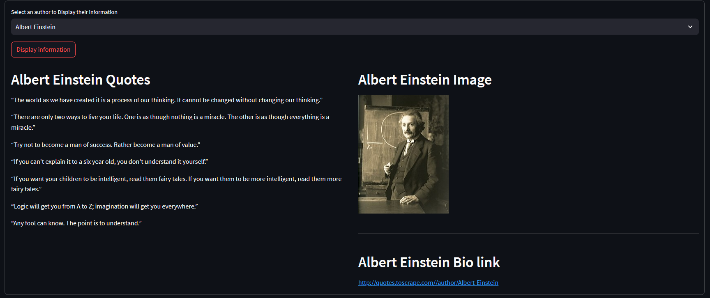
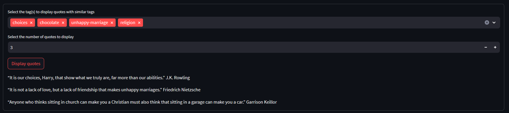

# Web Scrapping Analysis App
##  App Link : [Quotes Scrapping App](https://quotesapp.streamlit.app/)


This Streamlit web application demonstrates an example of web scraping aiming to extract quotes related information from the website [quotes to scrape](https://quotes.toscrape.com/) and provides visualizations and analytics. It allows the user to do the following : 
*  Scrape multiple multiple pages for a richer content.
*  Choose an author to display their related information.
*  Choose multiple tags to display quotes that share similar categories.
* Generate and display bar charts based on the scrapped data 
## Screenshots




## Required packages 
- Streamlit
- PIL (Python Imaging Library)
- Plotly
- requests
- BeautifulSoup
- matplotlib


To install the required packages, you can run:

```bash
pip install streamlit pillow plotly requests beautifulsoup4 matplotlib

```
## How to run the app 
Since this is an example project, I'd encourage you to clone this repository, check the source code behind the web app and modify it to your liking 
1. Clone or download the repository
2. Open terminal in the folder where the files are located
3. Run `streamlit run main.py`


## Known issues (Work in progress)
- App automatically launches with number of pages to scrape : 1 

## find a bug ?
If you notice an issue or would like to submit an improvement to this project, please submit it using the tab above


